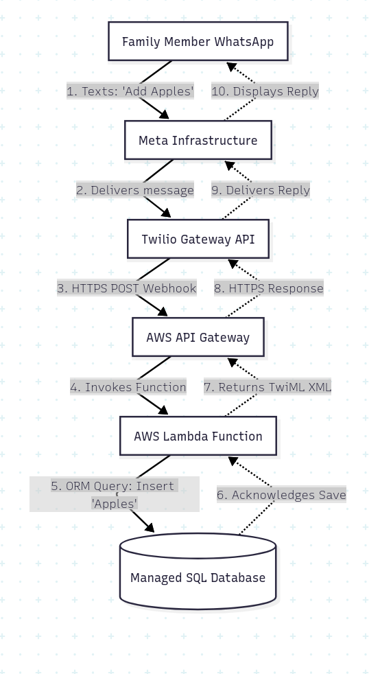

# Grocery List Chatbot

A WhatsApp assistant that turns everyday chat messages into a structured grocery
list. Users can add, update, remove, and review items without leaving the conversation.



### Stack

Python · SQLAlchemy · PostgreSQL · Twilio · AWS Lambda

### Brief summary of the project
Twilio receives WhatsApp messages, AWS Lambda handles the request, and SQLAlchemy
persists the resulting list changes in PostgreSQL.

### Contents

* [How to Run](#how-to-run)
* [Architecture](#architecture)
* [Improvements](#improvements)
* [Conclusion](#conclusion)

### How to Run
To run the chatbot, follow these steps:

1. Install dependencies with `pip install -r requirements.txt`.
2. Configure the PostgreSQL password locally in `.password`.
3. Run `python grocery_manager.py` locally or deploy `pg_grocery_manager.py` to Lambda.

```
# Local Postgres
$ python grocery_manager.py

🐘 Local Postgres Grocery Manager Initialized!
Commands: add [item] [qty] | modify [item] [qty] | delete [item] | list | exit
---------------------------

# AWS Lambda
$ python pg_grocery_manager.py
```

### Architecture

```markdown
+---------------+
|  WhatsApp    |
+---------------+
          |
          | (API Request)
          v
+---------------+
|  AWS Lambda  |
+---------------+
          |
          | (Function Execution)
          v
+---------------+
|  PostgreSQL  |
+---------------+
```

### Improvements

- Improve recovery from database and API failures.
- Move local secrets to managed configuration.
- Add caching where repeated reads justify it.

### Conclusion

The project connects conversational input, serverless execution, and relational
storage in a small end-to-end workflow.
